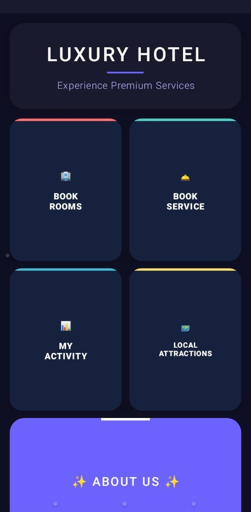
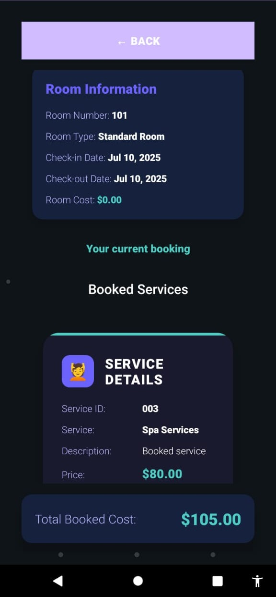
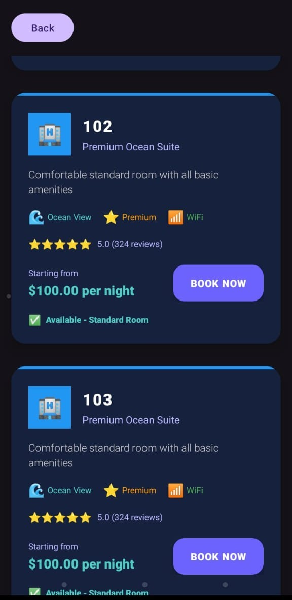

# 🌟 Luxevista Hotel App

[](https://github.com/codedbydumi/luxevista-hotel-app)
[](https://developer.android.com/)
[](LICENSE)

> **A modern Android app for booking luxury hotel rooms and services, exploring attractions, and managing reservations with a premium user experience.**

---

## 📱 Features

- 🛏️ Book and view hotel rooms with real-time availability
- 🛎️ Reserve premium services like spa and room cleaning
- 🗺️ Explore nearby local attractions and activities
- 🧾 View and manage all your bookings in **My Activity**
- 📖 Learn more about the hotel in the **About Us** section
- 🌙 Clean and modern dark theme with intuitive navigation

---

## 📸 Screenshots

| Home | Booking Details | Room Listing |
|------|------------------|--------------|
|  |  |  |

---

## 🛠️ Tech Stack

- **Language:** Java  
- **Framework:** Android SDK  
- **IDE:** Android Studio  
- **Design:** Material Design with dark mode  
- **Build:** Gradle Kotlin DSL - 

---

## 🚀 Getting Started

1. Clone this repository:
   ```bash
   git clone https://github.com/codedbydumi/luxevista-hotel-app.git````

2. Open with **Android Studio**
3. Let Gradle sync
4. Run on emulator or physical device

---

## 📂 Project Structure

```
luxevista-hotel-app/
│
├── app/                    # Main app code (Java, XML, resources)
├── gradle/                 # Gradle wrapper files
├── .idea/                  # IDE configuration
├── build.gradle.kts        # Project build config
├── settings.gradle.kts     # Gradle settings
└── .gitignore              # Ignore build/cache files
  ```

---

## 🧾 License

This project is licensed under the [MIT License](LICENSE).

---

## 🤝 Contributing

Contributions are welcome!
Please feel free to open issues, submit pull requests, or suggest enhancements.

---

## 🙌 Acknowledgements

Inspired by modern mobile design and real-world hotel booking systems.
Thanks to all open-source contributors and the Android community!

---

> Made with ❤️ by **codedbydumi**

